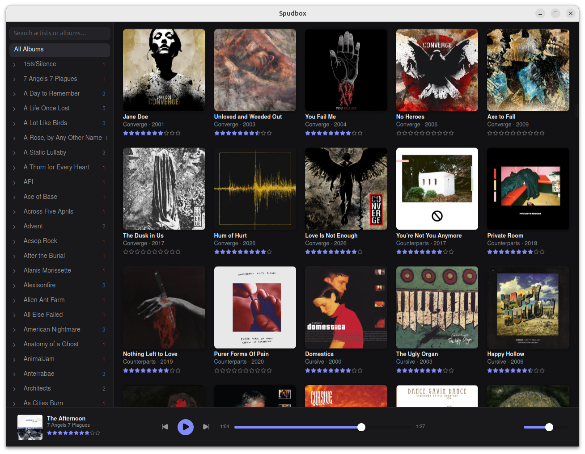
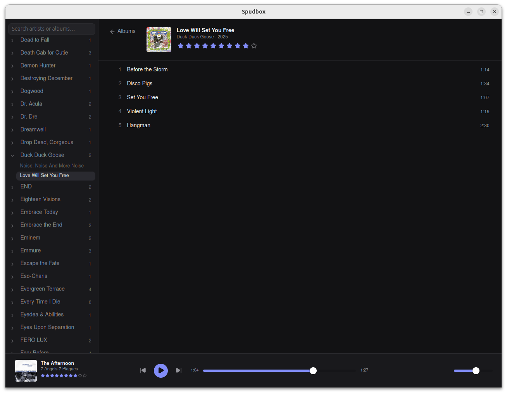

# Spudbox

A custom music player for Linux, built as a nicer alternative to Clementine: library browsing with album art, hi-res FLAC/MP3/AAC/WAV playback, gapless transitions, and MPRIS integration for system media controls. Built with Tauri v2, Rust, and Svelte.

<p align="center">
  
  
</p>

## Features

- Library scanning with incremental rescans (skips unchanged files), automatic on launch
- Browse by artist/album with a virtualized, art-forward grid and track list
- Hi-res playback (24-bit/96kHz+ FLAC and beyond) via a pure-Rust audio stack (`symphonia` + `rodio`/`cpal`) — no GStreamer dependency
- Gapless playback between queued tracks
- Album art extraction (embedded or folder cover images), cached as thumbnails
- 0–10 half-star album ratings, displayed in the grid and track list
- MPRIS integration (system media keys, GNOME/KDE media widgets)
- Play history and stats tracked per track
- Remembers volume and resumes the last queue/track (paused) on next launch
- **Cloud sync** — ratings and play counts sync across machines via a [Turso](https://turso.tech) database (free tier); configure once in Settings with a DB URL and auth token

## Prerequisites (Linux)

- Rust (via [rustup](https://rustup.rs))
- Node.js + npm
- System packages (Ubuntu/Debian):
  ```
  sudo apt install libwebkit2gtk-4.1-dev libasound2-dev libdbus-1-dev pkg-config
  ```
  Note: the generic Tauri prereq list includes several packages (`libxdo-dev`, `libayatana-appindicator3-dev`, etc.) that this project does not actually need.

## Development

```
npm install
npm run tauri dev
```

## Building an installable package

```
npm run tauri build -- --bundles deb,appimage
```

Produces a `.deb` (Debian/Ubuntu) and a portable `.AppImage` (any modern Linux distro) under `src-tauri/target/release/bundle/`.

## Testing

```
cd src-tauri && cargo test    # Rust: db queries (in-memory SQLite), the queue model, scanner helpers
npm run test                  # frontend: pure-logic helpers (vitest)
```

## Recommended IDE Setup

[Neovim](https://neovim.io/) with [nvim-lspconfig](https://github.com/neovim/nvim-lspconfig), running `rust_analyzer` for the Tauri backend and `svelte` (svelte-language-server) for the frontend. [mason.nvim](https://github.com/williamboman/mason.nvim) is the easiest way to install both servers.
